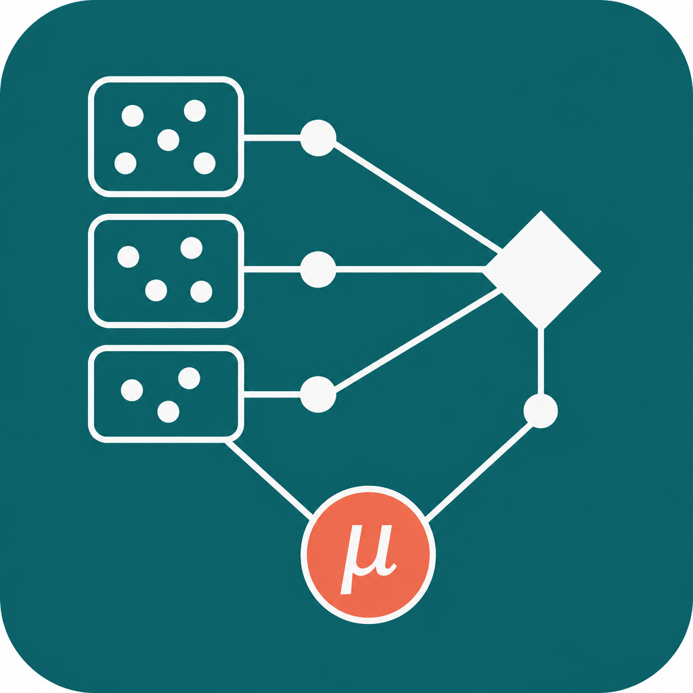

# bayesmetaipd

<p align="center">
  
</p>

Bayesian random-effects meta-analysis for **logistic** outcomes using
**individual participant data (IPD)** and **aggregate data (AD)**.


| Function | What it does |
|----------|----------------|
| `fit_ipd()` | IPD-only Benchmark (all studies as IPD) |
| `fit_ipd_ad()` | Proposed IPD + AD analysis with density-ratio adjustment |

---

## Installation

```r
install.packages("remotes")
remotes::install_github("yuanzhouu/bayesmetaipd")
```


---

## Quick start

```r
library(bayesmetaipd)

# IPD-only Benchmark (Simulation 2, rep_1 defaults)
fit <- fit_ipd()
colMeans(fit$posterior_mu)

# IPD + AD (Simulation 2 proposed method)
fit_ad <- fit_ipd_ad()
colMeans(fit_ad$posterior_mu)

```
> **Note.** Full default runs use 10,000 burn-in + 10,000 main iterations and can take several minutes (IPD) to about an hour (IPD+AD).

---

## Custom data

**IPD only** — covariate array `X` (`L × n × p`) and binary responses `Y` (`L × n`):

```r
fit <- fit_ipd(X = my_X, Y = my_Y, seed = 1)
```

**IPD + AD** — also supply AD summaries and an IPD indicator:

```r
fit <- fit_ipd_ad(
  X = my_X,
  Y = my_Y,
  beta_mat = my_beta,       # L x p working-model estimates
  V_beta_cube = my_V,       # L x p x p working variances
  is_ipd = my_is_ipd,       # length L; 1 = IPD, 0 = AD
  seed = 1
)
```


---

## Model (brief)

Hierarchical logistic random-effects model:

$$
\begin{aligned}
y_{li} \mid X_{li}, \theta_l &\sim \mathrm{Bernoulli}\!\bigl(\mathrm{logit}^{-1}(X_{li}^\top \theta_l)\bigr) \\
\theta_l \mid \mu, \Sigma &\sim \mathcal{N}(\mu, \Sigma)
\end{aligned}
$$

- **IPD-only:** Metropolis–Hastings for each $\theta_l$, then Gibbs for $(\mu, \Sigma)$.
- **IPD+AD:** same random-effects layer, plus a moment bridge from AD working-model estimates and a density-ratio adjustment for covariate shift.

See also the original code and data in [hang-kim-stat/Bayesian-Meta](https://github.com/hang-kim-stat/Bayesian-Meta).

---


## License

MIT © Yuan Zhou
